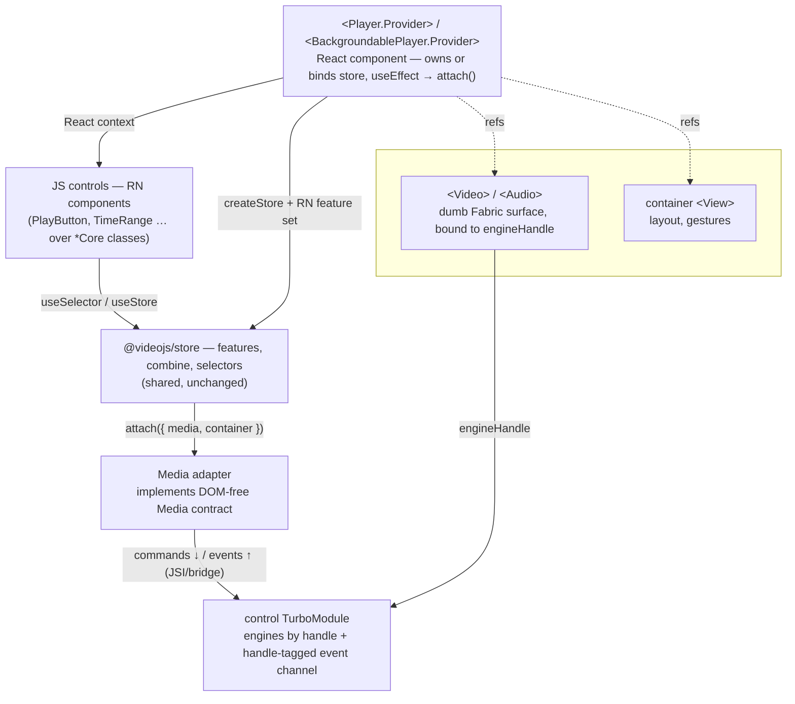
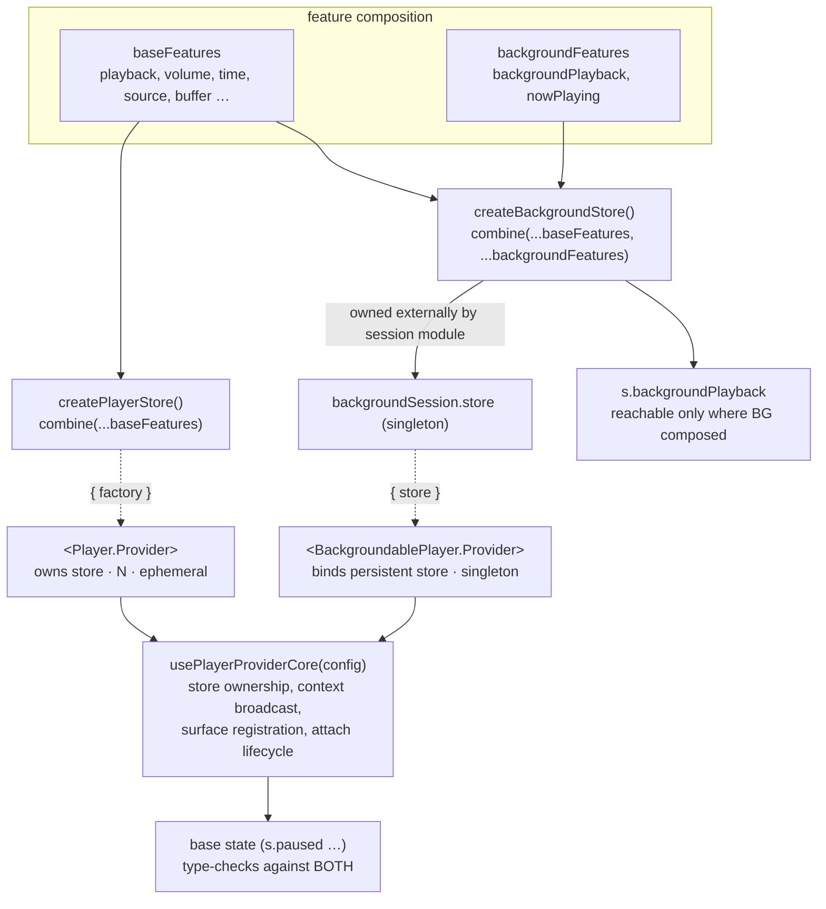
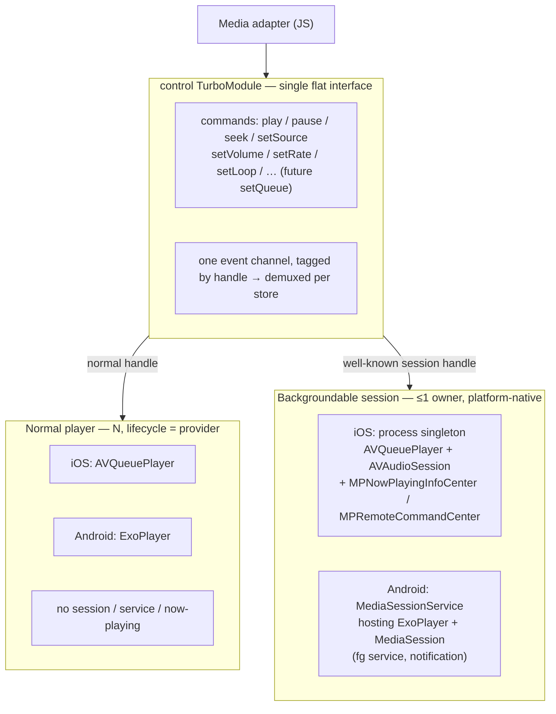
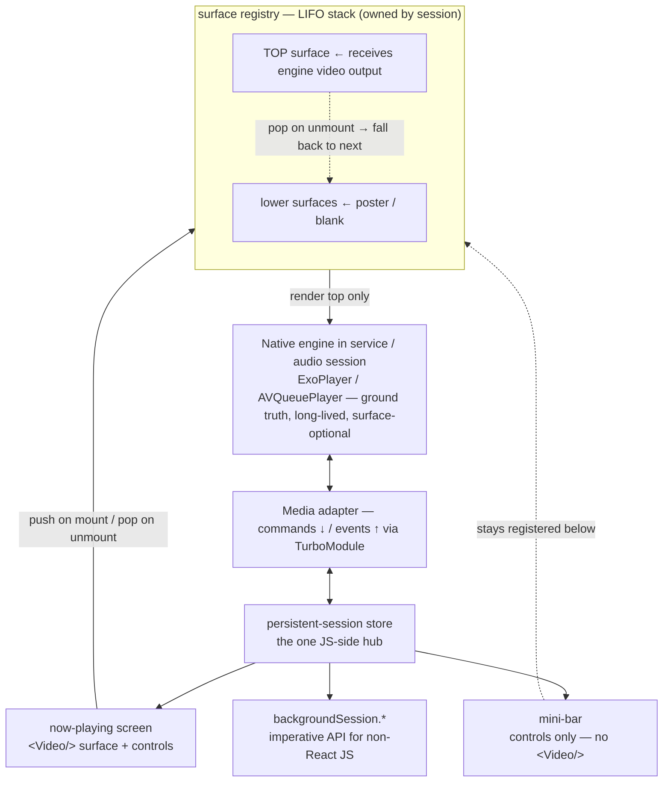

# React Native player

Bring the Video.js 10 player to React Native by reusing the framework-agnostic
store and React hooks, and replacing only the DOM-coupled layers (provider,
media element, DOM-specific features) with React Native equivalents.

## Problem

The `react-native` package is planned but unimplemented — there is no
`packages/react-native/` directory yet. We want a player on iOS and Android
that shares as much as possible with the web players rather than a parallel
codebase.

Two layers make this tractable, and two layers stand in the way:

**Already portable:**

- `@videojs/store` is framework- and DOM-agnostic — `createStore`,
  `defineSlice`, `combine`, `attach()`, selectors, and `AbortSignal` teardown
  touch no DOM. See [`packages/store/README.md`](../../../packages/store/README.md).
- `@videojs/store/react` hooks (`useStore`, `useSelector`, `useSnapshot`) are
  plain React and run unchanged under React Native.

**Not portable as-is:**

- The HTML provider is a **custom-element mixin** (`createProviderMixin` in
  [`packages/html/src/store/provider-mixin.ts`](../../../packages/html/src/store/provider-mixin.ts))
  built on the custom-element connect/disconnect lifecycle and the DOM context
  protocol. Neither exists in React Native.
- The player **features** in
  [`packages/core/src/dom/store/features/`](../../../packages/core/src/dom/store/features/)
  still reach for DOM globals in a few places — there is no `<video>` element in
  React Native; the media surface is a native player behind a JSI/bridge
  boundary.

  **This design commits to the DOM-free `Media` contract as the seam — RN
  implements the contract's capability interfaces, never a faked
  `HTMLMediaElement`.** That commitment is well-grounded: the contract is
  already built and adopted at the store boundary —
  [`core/media/types.ts`](../../../packages/core/src/core/media/types.ts)
  defines `EventLike` / `EventTargetLike` and the full set of capability
  interfaces (`MediaPauseCapability`, `MediaSeekCapability`, …),
  [`dom/media/predicate.ts`](../../../packages/core/src/dom/media/predicate.ts)
  provides the capability guards, and `PlayerTarget.media` is typed as `Media`
  (not `HTMLMediaElement`), so features already narrow via predicates rather
  than assuming a full element. RN supplies a native host implementing those
  interfaces (the web's `HTMLMediaElementHost` in
  [`dom/media/media-host.ts`](../../../packages/core/src/dom/media/media-host.ts)
  is the reference).

  The remaining work is **closing enumerated DOM leaks in the shared features**,
  not faking an element:
  - `playback.ts` / `source.ts` reference `HTMLMediaElement.HAVE_FUTURE_DATA` /
    `HAVE_ENOUGH_DATA` — these crash in RN (`HTMLMediaElement` is undefined).
    The contract already defines the constants (`MediaReadyState` in
    `core/media/types.ts`) but only exports the *type*; **exporting the constant
    and swapping these two references is a prerequisite** and removes the leak
    from two core features.
  - `volume.ts` (`document.createElement('video')` probe), `text-track.ts`
    (`querySelectorAll('track')`, `shadowRoot`), and `controls.ts` (`HTMLElement`
    casts, gesture coordinator) need RN feature variants regardless — see
    [State & store](#state--store).
  - Event wiring uses `listen` from `@videojs/utils/dom`; since `Media` only
    requires `EventTargetLike`, the RN host must implement
    `addEventListener`/`removeEventListener`, and a contract-native `listen`
    helper (not the DOM-typed one) may be warranted.

  `media.md` is still `status: draft`, so the contract surface could shift —
  tracked in [Open questions](#open-questions).

## Solution overview

Keep the store and the state shapes; replace the DOM-bound layers.

```
┌─────────────────────────────────────────────────────────────┐
│  JS controls (React Native components)                       │
│    consume the store via useSelector / useStore              │
└─────────────────────────────────────────────────────────────┘
                          ▲ React context
┌─────────────────────────────────────────────────────────────┐
│  <Player.Provider>  (React component, not an element mixin)  │
│    - owns the store (createStore + RN feature set)           │
│    - useEffect → store.attach({ media, container })          │
│    - broadcasts store via React context                      │
└─────────────────────────────────────────────────────────────┘
                          ▲ refs
┌──────────────────────────────┐    ┌─────────────────────────┐
│  <Video> / <Audio> (Fabric)  │    │  container <View>       │
│  dumb surface bound to an    │    │  player-wide surface    │
│  engine handle               │    │  (gestures, layout)     │
└──────────────────────────────┘    └─────────────────────────┘
                          ▲ JSI / bridge
┌─────────────────────────────────────────────────────────────┐
│  control TurboModule (engines by handle)                    │
│    → AVQueuePlayer / ExoPlayer | backgroundable session     │
└─────────────────────────────────────────────────────────────┘
```



Four pieces of new work, in dependency order:

1. **The native interface** — one control TurboModule (engines by handle) + one
   dumb Fabric surface, with platform-specific backings. See
   [Native module structure](#native-module-structure).
2. **A `Media` adapter** — implements the DOM-free `Media` contract from
   [`media.md`](../media.md) (capability interfaces + `EventLike` /
   `EventTargetLike`), *not* a fake `HTMLMediaElement`, by talking to the single
   control TurboModule for its handle. This is the seam that lets features stay
   shared. **This adapter — not the `<Video>` component — is what
   `store.attach({ media })` receives**, because the presets call the contract on
   it (`media.play()`, `media.currentTime`, `listen(media, …)`); see
   [What `media` is](#what-media-is-adapter-vs-surface).
3. **An RN provider component** — owns the store and the `attach()` lifecycle
   using React idiom (`useState` initializer + `useEffect`) instead of
   custom-element callbacks.
4. **RN feature variants** for the genuinely DOM-coupled concerns
   (fullscreen, PiP, pointer-driven controls activity, remote playback). State
   shapes stay identical so UI components and selectors are unaffected; only
   the `attach()` implementations differ.

The media-contract redesign in [`media.md`](../media.md) is the linchpin: it
already names React Native as a motivating case for decoupling the contract
from the DOM. RN is the first consumer that exercises a non-DOM `Media`
implementation end to end.

## Guiding principle: parity with the React player

The RN public API should be **as close to the `@videojs/react` player as
possible** — both in API contract (component names, prop names, hook
signatures, the provider/media/UI layer split) and in feature set. A developer
moving between the web and native players should reach for the same components,
pass the same props, and read the same store state.

Parity is the default; divergence is the exception, and each exception must be
justified by a genuine platform constraint, documented where it occurs:

- **DOM-only props/attributes** that have no native analog (and vice versa).
- **Styling** — React Native has no CSS, so the `@videojs/skins` mechanism
  can't transfer (see [Chrome / UI](#chrome--ui)); the *components* it styles
  should still match.
- **Accessibility** — ARIA maps to RN's `accessibility*` props (see
  [Accessibility](#accessibility)); the mapping changes, the behavior shouldn't.
- **Platform-only capabilities** that don't exist on the web — e.g. the
  `<BackgroundablePlayer.Provider>` and the persistent `backgroundSession`.

This is why the API surface below mirrors the web layer partition rather than
inventing a new one — same layers, same scoping rules, same names wherever the
platform allows.

## Quick start (target DX)

A regular (foreground, component-scoped) player:

```tsx
import { Player } from '@videojs/react-native';

<Player.Provider source="https://example.com/video.m3u8" loop>
  <Video />          {/* native player surface */}
  <Controls />       {/* RN components reading the store */}
</Player.Provider>;
```

The single persistent backgroundable player is a *separate* provider bound to
the app-owned session store (see
[Two providers over a shared core](#two-providers-over-a-shared-core)):

```tsx
import { BackgroundablePlayer } from '@videojs/react-native';

<BackgroundablePlayer.Provider>   {/* binds the singleton persistent session */}
  <Video />                   {/* attachable surface; absent in pure background */}
  <Controls />
</BackgroundablePlayer.Provider>;
```

State and actions are read the same way regardless of provider — and the
imperative API reads/writes the same session store:

```tsx
const paused = useSelector((s) => s.paused);
const { play, pause } = useStore();
```

## API surface

User-facing knobs follow the same layer partition as the web players — the
layer a prop lives in defines its scope. Per the
[parity principle](#guiding-principle-parity-with-the-react-player), component
and prop names match `@videojs/react` wherever the platform allows.

The RN API surface can use many of video.js's existing abstractions.

| Layer | Component | RN approach |
| --- | --- | --- |
| Preset | import path (`@videojs/react-native/video`) | Use the existing presets where possible |
| Provider | `<Player.Provider>` / `<BackgroundablePlayer.Provider>` | RN-specific Providers managing native player objects by handle via a TurboModule |
| Container | container `<View>` | player-wide surface: layout, gestures |
| Media | `<Video>` / `<Audio>` | "Dumb" rendering surface. Implemented by native SurfaceView/AVPlayerLayer/AVPlayerVC/etc |
| UI | `<PlayButton>`, `<TimeRange>`, … | individual chrome pieces. Reuse the `.*Core` classes for state logic |

The rest of this doc details how these abstractions can be used in an RN context.

## <Player.Provider> and <BackgroundablePlayer.Provider>

Two providers, one shared core — `<Player.Provider>` (foreground, N,
component-scoped) and `<BackgroundablePlayer.Provider>` (the singleton persistent
background session). Background playback is **not** a boolean on the regular
provider; it's a distinct component, because enabling it changes the contract on
four axes at once (lifetime, cardinality, store ownership, system integration).
See [Two providers over a shared core](#two-providers-over-a-shared-core) and
[decisions.md § Two providers over a shared core for background playback](decisions.md#two-providers-over-a-shared-core-for-background-playback).

## State & store

**The goal is to reuse the shared presets as-is.** RN composes the existing
`videoFeatures` / `audioFeatures` from
[`presets.ts`](../../../packages/core/src/dom/store/features/presets.ts)
directly — *not* a parallel RN feature set. The store, `combine`, selectors, and
state shapes (`paused`, `ended`, `started`, `waiting`, `volume`, `muted`,
`currentTime`, `duration`, …) are shared and unchanged; RN consumers read
identical state. Where a preset feature has a DOM leak, **the preferred fix is to
de-DOM the feature in the base lib** so the *same* feature runs on web and RN —
not to fork it.

Two kinds of preset feature, then:

- **Fixable in the base lib (keep shared).** Features that are logically
  platform-agnostic but reach for a DOM global — `playback` / `source`
  (readyState constants), `volume` (support probe), and the shared DOM utilities
  (`listen` / `onEvent` / `serializeTimeRanges`). De-DOM these in place so the
  preset uses the same code on both platforms. Enumerated and planned in
  [`media-contract-feature-reuse.md`](../../../.claude/plans/react-native/media-contract-feature-reuse.md);
  see also [Not portable as-is](#not-portable-as-is).
- **Inherently platform-specific (RN variant).** `fullscreen`, `pip`,
  `controls` activity, `remotePlayback`, `text-track` — DOM/platform APIs by
  nature. RN supplies feature variants with the **same state shape** but an RN
  `attach()` (`AppState`, `react-native-gesture-handler`, native modules), so UI
  components and selectors are unaffected.

So an RN preset is the shared preset with only the inherently-platform-specific
features swapped for RN variants; everything else is literally the shared
feature.

### Two providers over a shared core

The two providers differ on the [native-architecture](#native-architecture-independent-instances-platform-native-background)
and [persistent-session](#persistent-background-session) axes, but they share a
base. The feature API constructs that base directly — the same way `presets.ts`
derives `liveVideoFeatures` from `videoFeatures` by sharing a base array and
adding a few features.

**Axis 1 — what the store *is* (features + `combine`).** A shared base feature
array; the background provider's store composes the base plus background
features:

```ts
const baseFeatures = [playback, volume, time, source, buffer /* RN-shared set */];
const backgroundFeatures = [backgroundPlaybackFeature, nowPlayingFeature];
//   ^ backgroundPlaybackFeature.attach() wires AppState, audio focus, MediaSession/now-playing

const createPlayerStore     = () => createStore<PlayerTarget>()(combine(...baseFeatures));
const createBackgroundStore = () => createStore<PlayerTarget>()(combine(...baseFeatures, ...backgroundFeatures));
```

The system-integration difference reduces to "the background store composes one
more feature" — the platform wiring lives in that feature's `attach()`.

**Axis 2 — how the component *manages* the store (shared provider core).**
Store ownership (create vs. bind external), context broadcast, surface
registration, and attach lifecycle live in one shared core hook, parameterized
by the store. The two public components are thin wrappers:

```ts
function usePlayerProviderCore(config: { store: Store } | { factory: () => Store }) { /* ... */ }

Player.Provider           → usePlayerProviderCore({ factory: createPlayerStore })       // owns store, N, ephemeral
BackgroundablePlayer.Provider → usePlayerProviderCore({ store: backgroundSession.store })   // binds the persistent store, singleton
```

Store ownership/persistence is **core config, not a feature** — features compose
behavior; the core composes lifecycle.

**Type-level payoff.** Because the background store is `combine(base + bg)`, its
state is a superset of the base store's. `UnionSliceState` types each:

```ts
type PlayerState     = UnionSliceState<typeof baseFeatures>;
type BackgroundState = UnionSliceState<[...typeof baseFeatures, ...typeof backgroundFeatures]>;
```

A UI component reading *base* state (`s.paused`) type-checks against **both**
providers — so shared controls work on both. A component reading
`s.backgroundPlayback` only type-checks against the background store. The
BG-only surface is reachable only where the BG features are composed — honest
typing, enforced structurally.



**Keep BG features additive.** `combine` is last-wins on key conflict; if a
background feature overrode a base behavior the base would stop being a true
shared subset. Background features add slots (`backgroundPlayback`, now-playing
metadata); they don't replace base ones. Append after base so any intentional
override wins predictably.

The `backgroundPlaybackFeature` emits a `{ enabled, hasAudioFocus }` slot
reflecting whether this session holds the platform's single-owner background
slot (see [Native architecture](#native-architecture-independent-instances-platform-native-background)).

## Native architecture: independent instances, platform-native background

Two tiers, split by whether a player needs system integration at all:

- **Foreground players — N, one per `<Player.Provider>`, the common case.**
  Each provider owns an independent native player (an always-present
  `AVQueuePlayer` on iOS; `ExoPlayer` on Android) with **no** system
  integration — no session, no now-playing, no foreground service. They behave
  like web `<video>`s: feeds, grids, ambient + foreground, preloading, and
  two-visible-at-once all fall out naturally. No coordination is needed because
  they never touch the one-per-app system surfaces. This matches the web's
  per-provider model and the
  [parity principle](#guiding-principle-parity-with-the-react-player).

- **Background-enabled players — the exception, platform-native.** When
  `backgroundPlayback` is on, the player integrates with the platform's own
  background mechanism — no custom cross-platform coordinator is layered on top:
  - **Android:** the player's `ExoPlayer` is hosted by a Media3
    `MediaSessionService` / `MediaSession`. The service owns the foreground-
    service lifecycle, the media notification, and system-control routing. Used
    for background-enabled playback only; foreground players never start it.
  - **iOS:** the player configures `AVAudioSession` (`.playback` +
    `UIBackgroundModes: audio`) and populates `MPNowPlayingInfoCenter` /
    `MPRemoteCommandCenter`.

```
foreground (N)              background-enabled (≤1 owner)
┌──────────────┐            ┌──────────────────────────────────┐
│ ExoPlayer /  │  enable    │ Android: MediaSessionService/      │
│ AVQueuePlayer│ ─────────▶ │   MediaSession (fg service, notif) │
│  per provider│  bg        │ iOS: AVAudioSession + now-playing  │
│ (no system   │            │      + remote commands             │
│  integration)│            └──────────────────────────────────┘
└──────────────┘
```

**Single-owner is a policy, not a component.** The one-per-app system surfaces
admit at most one owner at a time, but each platform enforces that with its own
native mechanism (Android: the service hosting one session; iOS: ownership of
the app-global now-playing / audio-session singletons). A second player going
background displaces the first. There is no shared coordinator object in the
middle — only the JS contract: the
[`backgroundPlayback` feature](#state--store) requests background ownership, and
its `{ enabled, hasAudioFocus }` slot reflects whether this player currently
holds it. Consumers read that slot to arbitrate (e.g. pause a displaced player).

See [decisions.md § Multiple player instances; platform-native background, no custom coordinator](decisions.md#multiple-player-instances-platform-native-background-no-custom-coordinator).

> Detailed construction (the `MediaSessionService` wiring, iOS audio-session /
> now-playing sequencing, background hand-off) is an implementation concern —
> it belongs in a `.claude/plans/` plan, not this doc.

## Native module structure

The JS API is sliced into features, but the **native boundary is a single flat
interface** — features are a pure-JS store-composition concern that the native
side never sees. The one seam that maps the flat native surface to the sliced
capability contract is the JS `Media` adapter:

```
features ↔ store ↔ Media adapter ↔ ONE native interface
```

RN's New Architecture splits native into two artifact kinds — Fabric components
(views) and TurboModules (modules). The structure keeps a native MVC split but
**composes model and view in JS** to present one good React component:

- **Model = engine.** One **control TurboModule** is the single interface. It
  owns engines addressed by **handle**, and carries the full flat command set
  (`play` / `pause` / `seek` / `setSource` / `setVolume` / `setRate` / `setLoop`
  / … ; future `setQueue`) plus a **single event channel tagged by handle** that
  the adapter demuxes into the right store. Not sliced per feature.
- **View = surface.** One **dumb Fabric component** (`<Video>`): a window onto
  an `engineHandle` (props: handle, `resizeMode`, `poster`). It binds the native
  surface (`AVPlayerLayer` / Android `Surface`) and renders — **no control
  logic**. Commands and events live on the TurboModule.

### What `media` is (adapter vs. surface)

The web fuses two roles into one object: `HTMLMediaElement` is **both** the thing
the presets control (`media.play()`, `media.currentTime`, `listen(media, …)`)
**and** the rendered surface. So `store.attach({ media: videoEl })` reads a ref to
the rendered element and the two roles are never distinguished. **RN splits them**,
joined by the engine handle:

| Role | Web | RN |
| --- | --- | --- |
| Contract / control — `store.media`, what presets call | `HTMLMediaElement` | **the `Media` adapter** (forwards to the TurboModule by handle) |
| Render surface — pixels on screen | *the same* `HTMLMediaElement` | **`<Video>`** Fabric view (binds a handle) |

So `store.attach({ media })` receives the **adapter**, never the `<Video>`
component — the dumb surface has no `play` / `currentTime` / `addEventListener` by
design. This forces an ownership inversion from web: the engine + adapter are
**provider-owned** (foreground) or **session-module-owned** (background) and
created independently of any surface; the provider does `createEngine() → handle`,
wraps it in the adapter, `attach({ media: adapter })`, and *separately* hands the
handle to `<Video>` for rendering. That inversion is exactly what lets the presets
keep running with **no `<Video>` mounted** (background, audio-only) — if `<Video>`
owned the engine the way `HTMLMediaElement` does, surface-less playback would
collapse. See
[decisions.md § Engine and adapter ownership follows store ownership](decisions.md#engine-and-adapter-ownership-follows-store-ownership).

`container` does **not** invert the same way — it stays a real rendered `<View>`
ref (gestures/layout need an actual view). So `attach` is asymmetric in RN:
`media` is a synthetic handle-backed adapter, `container` is a genuine surface ref.

Control lives on the TurboModule (not Fabric view-commands) precisely because the
[persistent session](#persistent-background-session) must be controllable with
**no view mounted** — view-commands can't reach an absent view, but a
view-independent module can. See
[decisions.md § Dumb surface + single control TurboModule (engine-by-handle)](decisions.md#dumb-surface--single-control-turbomodule-engine-by-handle).

**Backing differs by handle kind, the interface does not:**

| Handle | Backing |
| --- | --- |
| Normal player | A plain engine the module owns — `AVQueuePlayer` (iOS, per the [looping decision](decisions.md#ios-looping-uses-an-always-present-avqueueplayer)) / `ExoPlayer` (Android). Lifecycle = the provider; destroyed on unmount. No session/service/now-playing. |
| Backgroundable session | The well-known **session handle**. Android: a Media3 `MediaSessionService` hosting the session's `ExoPlayer` + `MediaSession`. iOS: a process singleton owning the `AVQueuePlayer` + `AVAudioSession` + `MPNowPlayingInfoCenter` / `MPRemoteCommandCenter`. |



**Android service is declared by the app.** The library ships a ready-to-use
`MediaSessionService` subclass, but the **`<service>` entry lives in the app's
`AndroidManifest.xml`** (with `foregroundServiceType="mediaPlayback"`, the
`MediaSessionService` intent-filter, and the `FOREGROUND_SERVICE*` permissions).
This is the standard Media3 integration and gives maximum customization (custom
subclass, notification branding, service flags) for one documented integration
step. iOS has no service equivalent — the singleton + audio session is it.

This is what makes the [LIFO surface registry](#persistent-background-session)
fall out for free: multiple `<Video>` views sharing the session's `engineHandle`
register on the stack, and native renders frames into the top one only.

## Native integration (app setup)

Integration cost scales with what you use. **Foreground-only players need
nothing special** beyond network access; the **`BackgroundablePlayer` / remote
playback** require per-platform declarations, because the OS gates
foreground-service and background-audio behind app-level manifest/plist entries
the library cannot declare on the app's behalf.

> Exact keys/values are confirmed at implementation; the set below is the
> expected baseline and belongs in the package README once built.

### Foreground-only

- **Android** — `<uses-permission android:name="android.permission.INTERNET" />`
  for network sources. Nothing else.
- **iOS** — nothing (add `NSAppTransportSecurity` only if loading non-HTTPS).

### BackgroundablePlayer — Android

Declare the library's `MediaSessionService` subclass in *your*
`AndroidManifest.xml` (see
[decisions.md § Dumb surface + single control TurboModule](decisions.md#dumb-surface--single-control-turbomodule-engine-by-handle)),
plus the foreground-service and notification permissions:

```xml
<!-- permissions -->
<uses-permission android:name="android.permission.INTERNET" />
<uses-permission android:name="android.permission.FOREGROUND_SERVICE" />
<uses-permission android:name="android.permission.FOREGROUND_SERVICE_MEDIA_PLAYBACK" /> <!-- API 34+ -->
<uses-permission android:name="android.permission.POST_NOTIFICATIONS" />               <!-- API 33+, runtime -->

<application>
  <!-- the library ships the Service class; you register (and may subclass) it -->
  <service
    android:name=".PlaybackService"
    android:foregroundServiceType="mediaPlayback"
    android:exported="true">
    <intent-filter>
      <action android:name="androidx.media3.session.MediaSessionService" />
    </intent-filter>
  </service>
</application>
```

`POST_NOTIFICATIONS` is a runtime permission on API 33+ (the media notification);
the app requests it. Subclass the provided Service for custom notification
branding / service flags.

### BackgroundablePlayer — iOS

Enable the background-audio mode in `Info.plist` (the `audio` value also covers
AirPlay and Picture-in-Picture):

```xml
<key>UIBackgroundModes</key>
<array>
  <string>audio</string>
</array>
```

The library configures `AVAudioSession` (`.playback`) and now-playing at runtime;
no further plist entries are required for background audio. (`NSAppTransportSecurity`
only if loading non-HTTPS sources.)

## Persistent background session

The background-enabled player is also a **persistent session**: one playback
that outlives any single screen and is viewed/controlled through many surfaces
(a now-playing screen, a mini-bar in the feed, arbitrary JS). The model is
*one engine + one store, many clients* — not many players.

**Engine vs. surface.** The playback engine (`ExoPlayer` /
`AVQueuePlayer`, hosted by the `MediaSessionService` / audio session) is
app-owned and long-lived; it survives navigation and runs with **no surface
attached** in background. The video surface is a detachable window onto it —
iOS already splits `AVPlayer` (engine) from `AVPlayerLayer` (surface), Android
from `ExoPlayer` to `setVideoSurface(...)`. The surface can move between the
now-playing screen, a mini-bar, and nothing.

**Handle-based native wiring.** This maps directly onto the
[native module structure](#native-module-structure): the session is the
**well-known session handle** on the control TurboModule — distinct from a
normal player's per-instance `createEngine()` handle, and backed by the
`MediaSessionService` (Android) / process singleton (iOS) rather than a plain
engine the module owns. The dumb Fabric `<Video>` surfaces bind to *that*
handle, so the LIFO surface registry below is simply "multiple surfaces sharing
the session handle, native renders the top." The session handle outliving any
view is exactly why the engine survives with no surface mounted.

**One JS hub, three kinds of client.** All clients read selectors / dispatch
actions on the **same** persistent store; the imperative API is a thin JS
facade over that store, not a separate path to native:

```
Native engine (service)         ← ground truth
      │ adapter (commands down / events up, via TurboModule)
      ▼
persistent-session store        ← the one JS-side hub
      ├── now-playing screen     <Video/> surface + control components
      ├── mini-bar               control components only — no <Video/>
      └── backgroundSession.*    imperative API for non-React JS
```

Because the imperative API goes *through* the store, the reactive components and
imperative callers share one source of truth and stay in lockstep
automatically.

**Binding model — control is shared, video output is single-holder.** All
clients bind to the one session, but the two kinds bind differently:

- **Non-surface components (controls) — all bind, all control.** Every control
  (sidebar, mini-bar, now-playing) is just another subscriber/dispatcher on the
  same store; with one source of truth they can't desync. A control need **not**
  be a descendant of the provider — a sidebar elsewhere in the tree reaches the
  session via a `useBackgroundSession()` hook (or the imperative singleton),
  while descendants get it from React context. Both resolve the same store.
- **Rendering surfaces — latest-wins (LIFO).** The engine renders into **one**
  surface at a time (Android `setVideoSurface` is single-holder; iOS *could*
  mirror but two live surfaces is rarely wanted and costs perf), so latest-wins
  is the cross-platform policy. Surfaces register onto a **stack** owned by the
  session; the top of the stack receives the engine's video output, and any
  surface below shows poster/blank. When the top surface unmounts it **pops**,
  and output falls back to the next still-registered surface. This makes the
  canonical flow free: the mini-bar stays mounted, navigating to now-playing
  pushes a surface (claims output), tapping back pops it → output falls straight
  back to the mini-bar with no re-registration.

```
persistent-session store ── all controls bind & dispatch  (shared; context or useBackgroundSession())
        │
        └── surface registry (LIFO stack) ── engine renders into the TOP surface only
                                              lower surfaces: poster/blank; pop → fall back
```



**Externally-owned store (not a second architecture).** The store already
outlives mount — `attach`/`detach` are separate from create/destroy, and the
provider distinguishes *disconnect* (drop listeners, keep state) from *destroy*
(release store); see
[`provider-mixin.ts`](../../../packages/html/src/store/provider-mixin.ts). The
only new capability is: **a provider can bind to an externally-owned store
instead of creating its own.** The persistent session is that store, owned by
the session module rather than a component. This is the RN expression of
bring-your-own/hoisted store, a capability the web shares — so
[parity](#guiding-principle-parity-with-the-react-player) holds.

**Surface hand-off rides registration + the LIFO policy.** Two axes that the web
fuses but RN keeps separate (see
[What `media` is](#what-media-is-adapter-vs-surface)): the contract `media` (the
adapter) is attached to the session **once** and is stable, while the **LIFO
surface stack registers render targets** (`<Video>` handles) — a different axis
from `setMedia`. A surface component pushes onto the session's stack on mount and
pops on unmount, reusing the existing `setMedia` / `setContainer`
connect/disconnect *machinery* against the persistent store; the session points
the engine's video output at the current top.
Because the store is external and the engine lives in the service, popping a
surface does **not** stop playback. So the glitch-prone `AVPlayerLayer` re-point
/ `setVideoSurface` swap is driven by stack push/pop, handled by the same
connect/disconnect machinery — not a new mechanism. The session owns only a
small surface registry + the latest-wins/LIFO policy, not a coordinator.

> **Tentative:** LIFO (with fall-back-on-pop) is the committed default; the
> lighter alternative is a flat latest-pointer that blanks output when the top
> unmounts until something re-registers. Revisit if the stack proves awkward in
> practice.

**Scope: exactly one persistent session.** v1 supports a single background
session, matching the single-background-owner reality and keeping the imperative
singleton (`backgroundSession`) unambiguous. See
[decisions.md § Single persistent background session via an externally-owned store](decisions.md#single-persistent-background-session-via-an-externally-owned-store).

## Future work: remote playback (Cast / AirPlay)

> Not scoped or committed — recorded to show the proposed architecture absorbs
> remote playback cleanly, and to fix the intended direction before it's built.

Remote playback (Google Cast; AirPlay on iOS) has the **same two properties as
the background session**: only one player can cast at a time (single-owner), and
the cast session can outlive the UI that started it. So it composes into the
same persistent, single-owner session — it is *not* a new ownership model.

The architecture handles it without new primitives:

- **It's the RN form of `remotePlayback`, not a new concept.** The web already
  models this as `remotePlaybackFeature` ([`remote-playback.ts`](../../../packages/core/src/dom/store/features/remote-playback.ts))
  over the W3C Remote Playback API, with `MediaRemotePlaybackState` in
  [`media.md`](../media.md). **Mirror the W3C Remote Playback API shape wherever
  possible** — same state slots (`watchAvailability`, a `connect`-style action,
  a `connected`/device-name read) so the RN surface matches web
  [parity](#guiding-principle-parity-with-the-react-player). Cast is the
  cross-platform engine; AirPlay is the iOS side (`AVPlayer` handles much of it
  natively).

- **Cast is a *target switch*, modeled via the `Media` adapter — not a fat
  state-owning slice.** Casting swaps the store's attached `Media` from the
  local engine to a **remote `Media` implementation** wrapping the receiver
  (`RemoteMediaClient` / `GCKRemoteMediaClient`). Because `playback` / `time` /
  `volume` observe whatever `Media` is attached (the whole point of the DOM-free
  contract), they keep working unchanged — playback state comes from the remote
  client for free, with **one source of truth**. This is the engine-level analog
  of the [surface hand-off](#persistent-background-session): a remote engine
  swap on connect, transfer back to local on disconnect, both carrying position.

- **The Cast slice stays thin.** It manages session lifecycle (observe the Cast
  `SessionManager`, expose `isCasting` / device / availability) and triggers the
  adapter swap. Single-owner is enforced by the platform Cast SDK (one session
  manager), consistent with the
  [no-custom-coordinator decision](decisions.md#multiple-player-instances-platform-native-background-no-custom-coordinator).

- **Initiating cast from a foreground player is a hand-off**, not a reason to
  compose Cast into every provider. A cast button on an ordinary player hands its
  source to the persistent session (which then casts) — the same hand-off pattern
  as a feed item promoting to the now-playing session. Cast features compose into
  the persistent session, not foreground providers.

This is also the clearest case for the **naming consideration** in
[Open questions](#open-questions): background-audio and remote playback are
*sibling capabilities* of one persistent single-owner session, not sub-cases of
"background." The provider's identity may be better framed as the persistent
session than as `BackgroundablePlayer`.

## Future work: playlists / source queue

> Not scoped or committed — recorded to show the architecture absorbs it, and to
> flag a parity question that needs an RFC, **not** a unilateral RN call.

**v10 is single-source today.** `MediaSourceState`
([`core/media/state.ts`](../../../packages/core/src/core/media/state.ts)) is a
scalar `source: string | null` plus `loadSource(src)`, and the SPF explicitly
rules out queues —
[`source-replacement.md`](../spf/features/source-replacement.md): *"replacement
is teardown-then-rebuild; the engine doesn't support pre-warming the next source
… Playlist / queue semantics are out of scope."* So a playlist is net-new, and
the web's only path (app code calling `loadSource` on `ended`) has a **gap**
between items.

**Native players make it not just easy but better.** `AVQueuePlayer` and
ExoPlayer (`setMediaItems` / concatenating sources) hold a real queue and
**pre-buffer the next item for gapless transitions** — the pre-warm the web
engine can't do. It also reuses a decision already made: the always-present
`AVQueuePlayer` (chosen for [looping](decisions.md#ios-looping-uses-an-always-present-avqueueplayer))
*is* the queue — looping is a 1-item looped queue, a playlist is an N-item queue,
same object.

**How the architecture absorbs it — an optional capability, not a contract
change.** Model the queue as `MediaQueueCapability`, an *optional* capability in
the same pattern as `MediaPauseCapability` / `MediaSeekCapability`
([`core/media/types.ts`](../../../packages/core/src/core/media/types.ts)),
narrowed via an `isMediaQueueCapable` predicate:

- The RN native host implements it (gapless, pre-buffered). `HTMLMediaElement`
  does not, so web reports unsupported — or later adds a JS-managed fallback
  over `loadSource`.
- A `playlistFeature` mirrors queue state into the store with a **shared state
  shape** (`queue`, `currentIndex`, `next` / `previous` actions), so UI
  components stay portable.

This uses v10's own capability mechanism to expose a native queue without faking
it on web or bloating the base `Media` contract.

**The parity catch — this needs an RFC.** Unlike background/Cast (platform-only
capabilities that *can't* exist on the web), a playlist *could* exist on the web
— the web team chose to leave it out. So adding it to RN isn't platform-forced
divergence; it's RN getting **ahead** of web on feature set, which the
[parity principle](#guiding-principle-parity-with-the-react-player) flags as
needing justification. To avoid drift: design `MediaQueueCapability` and the
`playlistFeature` state shape as the **shared cross-platform concept** (web can
adopt the same feature later, backed by `loadSource`), and treat "does playlist
become a cross-platform feature" as an RFC question — not a unilateral RN call.

## Chrome / UI

Chrome is drawn in **RN by default**. The overlap with the DOM chrome is large
but sits *below the render line*: every control already has a framework-agnostic
headless core in [`core/ui/*`](../../../packages/core/src/core/ui/)
(`PlayButtonCore`, `MuteButtonCore`, `FullscreenButtonCore`, sliders, …) that
imports only `@videojs/store` + `@videojs/utils` — no DOM. On web, `@videojs/react`'s
`createMediaButton` is a thin adapter: instantiate the core, wire it to the store
via a selector, render a `<button>`, and map core state → data-attributes for
CSS. RN swaps **only that top layer**.

**Reuse strategy (same shape as [feature reuse](#state--store)):**

1. **Reuse the `*Core` classes as-is** — they compute state / label / actions
   from the store with no DOM.
2. **An RN render adapter** (analog of `createMediaButton`) instantiates the
   core, consumes the store via the existing `useSelector` / `usePlayer` hooks
   (unchanged in RN), renders `Pressable` / `View` / `Text`, and maps core state
   → **style + `accessibility*` props** instead of data-attributes + ARIA.
3. **Component names, props, and the `render` prop pattern match web**
   (`<PlayButton render={(props, state) => …} />`) — the parity surface; only
   the rendered primitives differ.

Does not transfer: `createMediaButton` (DOM), the `stateAttrMap` / data-attribute
styling hooks, `useButton` / `renderElement`, DOM elements, ARIA, and the
slider's pointer-event machinery.

### Theming (no CSS)

`@videojs/skins` (CSS + Tailwind tokens) does not transfer. Instead: a **theme
tokens object** (colors, spacing, radii, typography, icon set, control sizes,
light/dark) via a `ThemeProvider` / context; each component computes a
`StyleSheet` from tokens + its core state. Bounded but real — covers colors,
sizing, dark mode (`useColorScheme`), responsive (`useWindowDimensions`), icon
swaps, and part show/hide; no arbitrary cascade / pseudo-classes / media queries.
**Mirror the `@videojs/skins` `@theme` token names/semantics** in the RN tokens
so theming *concepts* carry across even though CSS → `StyleSheet` is a hard
divergence.

### Three chrome modes

1. **Default — RN-drawn chrome.** A default skin: RN components over the shared
   cores, themeable via tokens. Ships out of the box.
2. **System chrome — a *separate* `<Video>` variant.** A distinct surface
   component backed by the platform's controls-bearing view (iOS
   `AVPlayerViewController`; Android ExoPlayer `PlayerView` / `PlayerControlView`)
   — native polish, AirPlay route picker, native PiP/fullscreen UI and platform
   a11y for free, at the cost of custom control and theming. Stays consistent
   with the model: native controls drive the engine, the store still mirrors
   (engine = source of truth). **Tentative:** a separate variant rather than a
   `controls="system"` mode flag, because the platform controls view *owns* the
   presentation (`AVPlayerViewController` is a full `UIViewController`, not a bare
   layer) and a separate component avoids re-creating the native view on a
   runtime mode switch. See
   [decisions.md § System chrome is a separate `<Video>` variant](decisions.md#system-chrome-is-a-separate-video-variant-tentative).
3. **Headless / BYO.** No default chrome; the app composes UI components or raw
   store hooks itself.

> **The slider is the long pole.** Scrubber/volume has the least logic-reuse
> benefit and the most platform work — web leans on `<input type=range>` /
> pointer events; RN needs `react-native-gesture-handler` + Reanimated plus
> buffered-range / thumbnail / chapter overlays. Prototype the time-slider first.

## Accessibility

React Native accessibility uses `accessibilityRole`, `accessibilityLabel`,
`accessibilityState`, and the platform focus model rather than ARIA. UI
components need RN-native a11y props mapped from the same store state the web
components expose via ARIA (e.g. play/pause `accessibilityState={{ selected }}`).
Detailed mapping is deferred until the UI component layer is scoped.

## Open questions

- **Closing the shared-feature DOM leaks.** The direction is committed —
  adapter-shared features generalize over the `Media` contract (see
  [decisions.md § Media adapter implements the Media contract](decisions.md#media-adapter-implements-the-media-contract-not-a-fake-htmlmediaelement)
  and [Not portable as-is](#not-portable-as-is)). The required base-lib work is
  audited and planned in
  [`.claude/plans/react-native/media-contract-feature-reuse.md`](../../../.claude/plans/react-native/media-contract-feature-reuse.md)
  (export `MediaReadyState`; DOM-free `listen`/`onEvent`/`serializeTimeRanges`;
  a non-DOM volume probe; verify against an in-memory `Media` host). The one
  genuine unknown is `media.md`'s `draft` status — the contract surface could
  shift before this work lands.
- **Persistent session naming: "backgroundable" vs. capability-neutral.**
  `BackgroundablePlayer` was chosen to disambiguate from vjs's existing
  *ambient-video* "background" preset (`backgroundFeatures` /
  `BackgroundVideoSkin`) — here "background" means *app-backgrounded playback*,
  not video behind page content. But `<BackgroundablePlayer.Provider>` still
  reads as background-audio-specific, while the same persistent single-owner
  session also hosts [remote playback](#future-work-remote-playback-cast--airplay)
  (Cast/AirPlay) — sibling capabilities, not sub-cases of background. A
  capability-neutral name (e.g. a persistent-session provider with `background`
  and `remotePlayback` composed in) may age better. Defer until remote playback
  is scoped, since it's the second capability that forces the question.
- **Toolchain / build mode.** A `react-native` (or `neutral`) tsdown platform
  mode, RN-aware `tsconfig` (no `dom` lib), peer deps on `react` +
  `react-native`. Verification (Expo example app vs. bare RN vs. CI simulator
  runs) is the dominant cost, not the package itself.
- **Theming details.** Direction is set ([Chrome / UI](#chrome--ui)): a theme
  tokens object + `StyleSheet`, mirroring `@videojs/skins` `@theme` token
  names. Open: raw `StyleSheet` vs. a styling library, and the exact token set.
- **System-chrome variant shape.** The separate-`<Video>`-variant call is
  [tentative](decisions.md#system-chrome-is-a-separate-video-variant-tentative);
  open: the variant's API/naming and how much of the store-driven control model
  it cedes to the native controls.
- **Native player libraries.** Whether to build on `react-native-video` /
  `expo-video` or a custom Fabric component. The `Media` adapter is the
  insulation layer regardless.
- **`backgroundPlayback` evolution.** Boolean for v1; whether it later grows to
  `'audio-only' | 'full'` modes. App-global platform config (`Info.plist`
  `UIBackgroundModes`, Android foreground service) is separate from the
  per-player flag.

## Related

- [`media.md`](../media.md) — the DOM-free `Media` contract this package is the
  first non-DOM consumer of.
- [`packages/store/README.md`](../../../packages/store/README.md) — the shared
  store and slice/feature model.
- [`packages/html/src/store/provider-mixin.ts`](../../../packages/html/src/store/provider-mixin.ts)
  — the web provider whose lifecycle the RN provider mirrors in React idiom.
- [`packages/core/src/dom/store/features/`](../../../packages/core/src/dom/store/features/)
  — the feature set the RN feature set parallels.
- [decisions.md](decisions.md) — debated decisions for this design.
